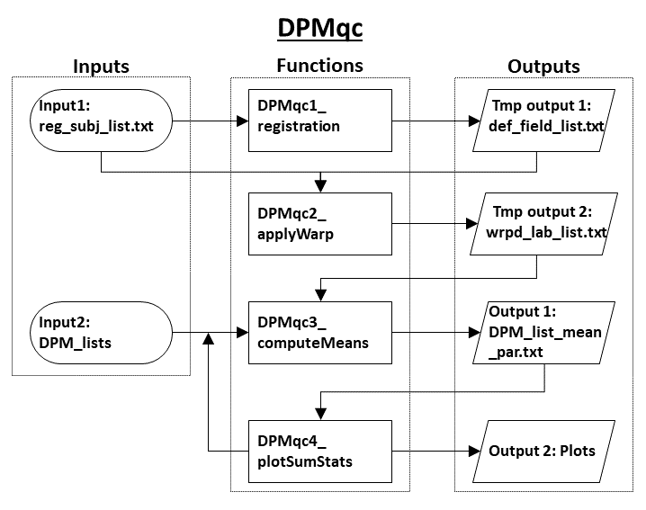
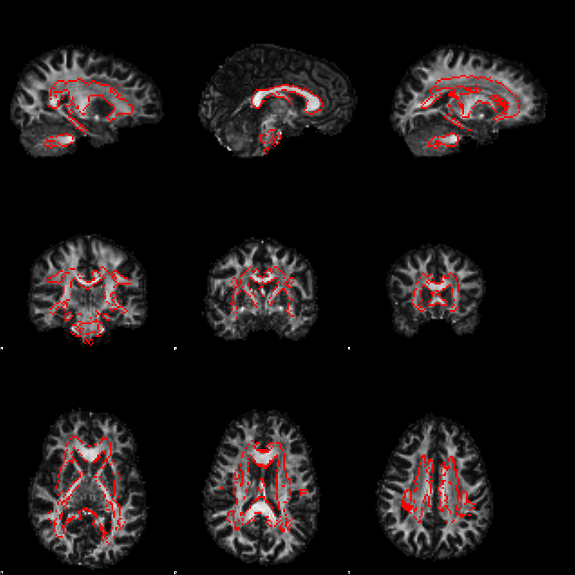

# Purpose

This tool supports quality assessment of diffusion-derived parameter maps (DPM).

# Description

Diffusion-derived parameter maps may be biased by image acquisition and processing artefacts. This tool produces summaries of parameter values in white matter ROIs, where their value is expected to be stable across subjects. Biases are often subject dependent and can therefore be identified by examining the outlying subjects for each ROI. 

# Prerequisites

## Software

MATLAB (https://uk.mathworks.com/downloads/)

NIfTI toolbox (https://uk.mathworks.com/matlabcentral/fileexchange/8797-tools-for-nifti-and-analyze-image)

FSL (https://fsl.fmrib.ox.ac.uk/fsl/fslwiki/FslInstallation)

ImageMagick (https://imagemagick.org/script/download.php)

To get the summary statistic plots the following Matlab utilities need also to be downloaded and added to the Matlab path:

Violin plot (https://uk.mathworks.com/matlabcentral/fileexchange/45134-violin-plot)

Tight subplot (https://uk.mathworks.com/matlabcentral/fileexchange/27991-tight_subplot-nh-nw-gap-marg_h-marg_w)

Export_fig (https://uk.mathworks.com/matlabcentral/fileexchange/23629-export_fig)

Xml2struct (https://uk.mathworks.com/matlabcentral/fileexchange/28518-xml2struct)

# Download

Download the toolbox as .zip or git clone using
```bash
git clone https://github.com/garyhuizhang/dtitk
```

# Installation

Add the tool directory (dtitk/addons/DPMqc) to your MATLAB path.

# Usage

## Input

### Main inputs
- reg_subj_list - Path to .txt file listing absolute paths to target images for atlas registration.
- DPM_lists - Paths to .txt file organized in cell array data type. The files list the absolute paths to parameter maps to assess for outliers. Images should correspond to reg_subj_list.

### Optional inputs
- labels_list - path to .txt file listing the ROI labels in which to compute mean values. The ROI labels are natural numbers from 1 to 48. Check "$FSLDIR/data/atlases/JHU-labels.xml" for correspondence. If empty, default ROIs are used.
- fsl_path - specify the path to fsl directory. You can retrieve this by typing 
```bash
echo $FSLDIR
```
on command window.

## Output

The outputs are saved in the directory from which the analysis is run. Hence it is suggested to do it in an ad hoc directory.
The output includes:  

- <DPM_list_name>_mean_par.txt - mean parameter value in ROIs for each subject (row) and each ROI (column)
- Plots of the subjects diffusion parameter mean values for each ROI with outliers clearly shown (These are saved in a folder named "plotSumStats" which is created within the process).


## Typical usage

```matlab
DPMqc(reg_subj_list, {DPMlist_1, DPMlist_2, .., DPMlist_n}, labels_list, fsl_path)
```

## Example commands

### Create the working directory

```matlab
mkdir('DPMqc');
cd('DPMqc')
```

### Create the parameter lists

subjlist_FA.txt:
```bash
~/mystudy/subj1/DiffParams/dti_FA.nii.gz
~/mystudy/subj2/DiffParams/dti_FA.nii.gz
...
~/mystudy/subjN/DiffParams/dti_FA.nii.gz
```
subjlist_NDI.txt:
```bash
~/mystudy/subj1/NODDIParams/FIT_ICVF.nii.gz
~/mystudy/subj2/NODDIParams/FIT_ICVF.nii.gz
...
~/mystudy/subjN/NODDIParams/FIT_ICVF.nii.gz
```
subjlist_ODI.txt:
```bash
~/mystudy/subj1/NODDIParams/FIT_OD.nii.gz
~/mystudy/subj2/NODDIParams/FIT_OD.nii.gz
...
~/mystudy/subjN/NODDIParams/FIT_OD.nii.gz
```
etc ...

### Create the labels list
roi_labels.txt:
```bash
3
4
5
```
Respectively the genu, body and splenium of corpus callosum.

### Run the analysis

```matlab
DPMqc('subjlist_FA.txt', {'subjlist_FA.txt', 'subjlist_NDI.txt', 'subjlist_ODI.txt'}, roi_labels.txt, '/usr/local/fsl')
```

Other examples are:
- Use default labels:
```matlab
DPMqc('subjlist_FA.txt', {'subjlist_FA.txt', 'subjlist_NDI.txt', 'subjlist_ODI.txt'}, [], '/usr/local/fsl')
```
- Try to use the fsl environment viarable $FSLDIR (not recommended on mac):

```matlab
DPMqc('subjlist_FA.txt', {'subjlist_FA.txt', 'subjlist_NDI.txt', 'subjlist_ODI.txt'}, 'roi_labels.txt', [])
```
- Don't output the summary statistic plots:

```matlab
DPMqc('subjlist_FA.txt', {'subjlist_FA.txt', 'subjlist_NDI.txt', 'subjlist_ODI.txt'}, , 'roi_labels.txt', '/usr/local/fsl', 0)
```

## NOTE
The programme is base on a non-linear registration between the input maps specified by reg_subj_list and the JHU FA template (2mm). The success of the analysis thus strongly depends on the quality of the registration. Intermediate output files are produced to check the quality  of the alignment between the reg_subj_list inputs and the JHU labels warped in the subject native space. These are .png files which are stored in the same directory as indicated by reg_subj_list paths (named as JHU_labels_to_<targ_name>.png). They show the parametric map on the background and the JHU labels edges on top of it, from different views, for each subject. The Main topological structures should match. PLEASE CHECK IT !!



