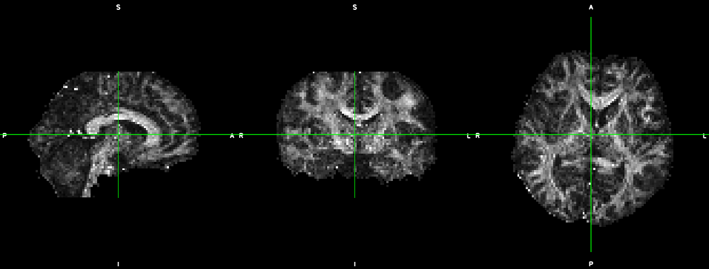

# dtitk/addons/RemoveFAring

# Purpose

This DTI-TK addon helps to remove the high FA ring around the brain.

# Problem

Fractional anisotropy (FA) images of brains can often have a bright ring around the edge of the parenchyma, often caused by a loose brain mask. This bright ring is often a cause of imperfect image registration. Removing it can help reduce or eliminate cases of poor image registration.

An illustration of the bright ring, using [the DTI-TK example dataset](http://www.nitrc.org/frs/download.php/1237/DTITK_Sample_Data.zip), is shown below: .

# Prerequsites

This addon is a unix bash script that uses both DTI-TK and FSL utilities. Thus you should have both programs installed; instructions to install them can be found http://dti-tk.sourceforge.net/pmwiki/pmwiki.php?n=Documentation.Install and https://fsl.fmrib.ox.ac.uk/fsl/fslwiki/FslInstallation respectively.

# Download

You can download the script either as a zip archive or as a git clone from https://github.com/garyhuizhang/dtitk.

# Installation

You can either add the directory containing the script to your system PATH or move the downloaded script directly into the DTI-TK scripts folder. The second option may require administrative privilege.

# Usage

## Input

The script takes as input an FA map; the FA map is expected to have been already masked. You can additionally provide as a separate input your desired base name for the outputs; see next.

## Output

It outputs the map without the FA ring, as well as a binary mask which excludes the removed FA ring voxels. For the illustrative example above, the resulting output from the script is .

## Example commands

Typical usage:

```bash
  faRing_rm path/to/fa_map
```

If specifying the output base name:

```bash
  faRing_rm path/to/fa_map path/to/output/base_name
```

# Test dataset

The dataset used above for illustration is the freely available [DTI-TK example dataset]( https://www.nitrc.org/frs/download.php/1237/DTITK_Sample_Data.zip).
